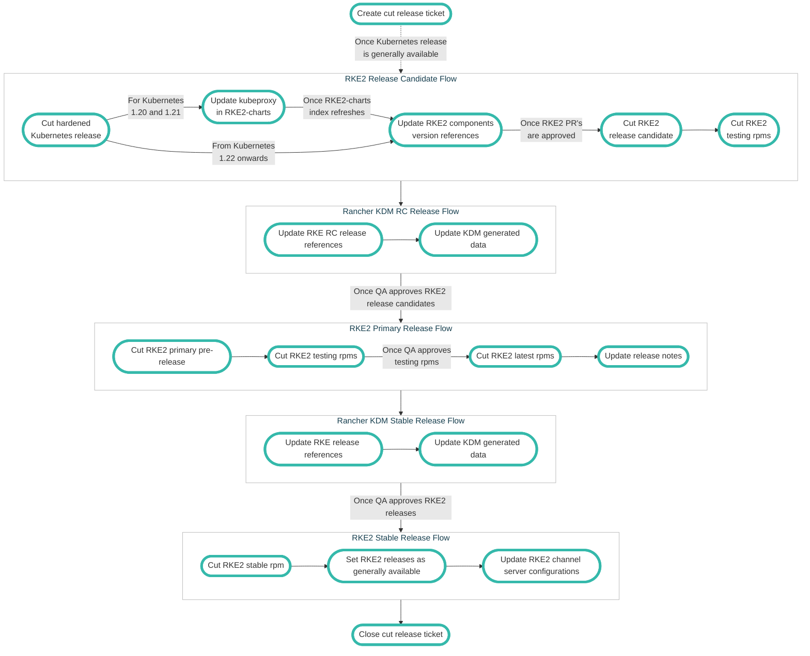

# Upgrade Kubernetes Process

From time to time, we need to update the version of Kubernetes used by RKE2. This document serves as a how-to for said process and elaborates on what constitutes a "release". The steps described in the document are laid out in order.

**NOTE:** This process will be needed whenever a new release is required, even when no new Kubernetes release is available. A handy checklist can be found [here](#release-process-overview).

- [Upgrade Kubernetes Process](#upgrade-kubernetes-process)
  - [QA Releases](#qa-releases)
  - [Hardened Kubernetes](#hardened-kubernetes)
  - [Update RKE2](#update-rke2)
  - [RKE2 Release RC](#rke2-release-rc)
    - [RKE2 Packaging](#rke2-packaging)
    - [Primary Release](#primary-release)
    - [Release Notes](#release-notes)
      - [Packaged Components](#packaged-components)
  - [Update Rancher KDM](#update-rancher-kdm)
    - [Promoting to Stable](#promoting-to-stable)
    - [Updating Channel Server](#updating-channel-server)
  - [Release Process Overview](#release-process-overview)

## QA Releases

If QA requires a release candidate (RC) for testing efforts before a Kubernetes patch is available, a new RC should be created with the most current Kubernetes release. For example, if QA wants a release for v1.23.5 before the Kubernetes patch, and the most recent release is v1.23.5+rke2r1, a tag should be cut for v1.23.5-rc1+rke2r1 release. Note that doing so will also require tagging v1.23.5+rke2r1 in image-build-kubernetes and bumping versions across rke2-charts and rke2, as if preparing for a full release.

## Hardened Kubernetes

The Hardened Kubernetes build process for RKE2 was once part of the RKE2 build process itself. It's been since split out and exists on its own in the [image-build-kubernetes](https://github.com/rancher/image-build-kubernetes) repository. Follow the steps below to create a new Hardened Kubernetes build.

Create a new release tag at the [image-build-kubernetes](https://github.com/rancher/image-build-kubernetes) repo.

* Click "Releases"
* Click "Draft a new release"
* Enter the new release version (the RKE2 Kubernetes version), appended with `-buildYYYYMMdd`, into the "Tag version" box.  **NOTE** The build system is in UTC. The command `TZ=utc date '+-build%Y%m%d'` can be used to get the correct format.
* When converting the RKE2 version to the Kubernetes version, use dash instead of plus, and do not include any alpha/beta/rc components. For example, if preparing for RKE2 `v1.23.5+rke2r1` before 5 PM Pacific on Friday, August 27th 2021 you would tag `v1.23.5-rke2r1-build20210829`
* Click the "Publish release" button. 

This will take a few minutes for [CI](https://drone-pr.rancher.io/rancher/image-build-kubernetes) to run but upon completion, a new image will be available in [Dockerhub](https://hub.docker.com/r/rancher/hardened-kubernetes).

## Update RKE2

The following files have references that will need to be updated in the respective locations. Replace the found version with the desired version. There are also references in documentation that should be updated and kept in sync. 

* Dockerfile: `FROM rancher/hardened-kubernetes:v1.23.5-rke2r1-build20220217 AS kubernetes`
* version.sh:
  * `KUBERNETES_VERSION=${KUBERNETES_VERSION:-v1.23.5}`
  * `KUBERNETES_IMAGE_TAG=${KUBERNETES_IMAGE_TAG:-v1.21.13-rke2r1-build20220525}`
* In v1.21, kube-proxy is still in use an needs to be updated in the Dockerfile. Update the line: `RUN CHART_VERSION="v1.21.10-build2021041301"     CHART_FILE=/charts/rke2-kube-proxy.yaml` to the relevant RKE2 Kubernetes build version.
* go.mod: ensure that the associated k3s version is used.

Once these changes are made, submit a PR for review and let CI complete. When CI is finished and upon getting 1 approval, merge the PR. CI will run for the master merge. 

## RKE2 Release Candidate

Next, we need to create a release candidate (RC). The Drone (CI) process that builds the release itself can be monitored [here](https://drone-publish.rancher.io/rancher/rke2/).

* Click "Releases"
* Click "Draft new release"
* Select the target branch
* Enter the desired version into the "Tag version" box. 
    * Example tag: `v1.23.5-rc1+rke2r1`
    * **NOTE** Make sure to create the tag against the correct release branch. In the example above, that would map to release branch `release-1.23`.

Ensure "Set as a pre-release" checkbox is selected.
Ensure "Set as the latest release" is **NOT** selected.

CI will run and build the release assets as well as kick off an image build for [RKE2 Upgrade images](https://hub.docker.com/r/rancher/rke2-upgrade/tags?page=1&ordering=last_updated).

_**Note: Once an RC is released for QA, the release branch associated with the RC is now considered frozen until the final release is complete. If additional PRs need to get merged in after an RC, but before the final release, you should notify the RKE2 team of this immediately. After merging, an additional RC will need to be released for QA.**_

### RKE2 RC RPM Packaging

Along with creating a new RKE2 release, we need to trigger a new build of the associated RPM. These are found in the [rke2-packaging](https://github.com/rancher/rke2-packaging) repository. We need to create a new release here and the process is nearly identical to the above steps. The Drone (CI) process that builds the release itself can be monitored [here](https://drone-publish.rancher.io/rancher/rke2-packaging/).

* Click "Releases"
* Click "Draft new release"
* Select the target branch
* Enter the desired version into the "Tag version" box. 
    * Example tag: `v1.23.5-rc1+rke2r1.testing.0`
    * The first part of the tag here must match the tag created in the RKE2 repo.

When CI completes, let QA know so they can perform testing.

### Communicating with QA

When coordinating release efforts it is important to maintain a clear line of communication with the QA team. This is best done by relaying timely updates in the release thread of the #discuss-k3s-rke2-release channel in the organisations slack. It is best to notify QA once RCs, RPMs, and KDM PRs are available. Fill in the template below and paste it into the release thread:

```
RKE2 <tag> is now available for testing! @k3s-rke2-qa
KDM PRs:
<links to relevant KDM PRs>
RC:
<links to relevant rcs>
RPM:
<links to relevant rpms>
```

### Primary Release

Once QA signs off on the RC, it's time to cut the primary release. Go to the [rke2](https://github.com/rancher/rke2) repository.

* Click "Releases"
* Click "Draft new release"
* Enter the desired version into the "Tag version" box. 
    * Example tag: `v1.23.5+rke2r1`

Ensure "Set as a pre-release" checkbox is selected.
Ensure "Set as the latest release" is **NOT** selected.

Once complete, the process is repeated in the [rke2-packaging](https://github.com/rancher/rke2-packaging) repository.

* Click "Releases"
* Click "Draft new release"
* Enter the desired version into the "Tag version" box. 
    * Example tag: `v1.23.5+rke2r1.testing.0`
    * The first part of the tag here must match the tag created in the RKE2 repo.

Make sure that CI passes. This is for RPM availability in the testing channel.

Once complete, perform the steps below for the "**latest**" RPMs.

* Click "Releases"
* Click "Draft new release"
* Enter the desired version into the "Tag version" box. 
    * Example tag: `v1.23.5+rke2r1.latest.0`
    * The first part of the tag here must match the tag created in the RKE2 repo.

We will wait at least 24 hours in case the community finds an issue. Patches will need at least 24 hours. 

We then create the "**stable**" RPMs. Follow the steps below.

* Click "Releases"
* Click "Draft new release"
* Enter the desired version into the "Tag version" box. 
    * Example tag: `v1.23.5+rke2r1.stable.0`
    * The first part of the tag here must match the tag created in the RKE2 repo.

### Release Notes

 The drafting of release notes occurs in the [Rancher Labs - Release Notes](https://github.com/rancherlabs/release-notes) repository. To begin drafing release notes create a new branch from your fork and update the relevant files in `rke2/` directory. The release note files have been standardized and should adhere to the existing style and formatting.

The 2 primary sections of the release notes are the "Changes since ..." and the "Package Component Versions". The other sections need to be reviewed as well. The "Changes since ..." section can be fleshed out by reviewing the closed issues and pull requests for the matching milestone.

#### Packaged Components
It can be confusing to track where each number for a component is getting pulled from.

Here are some locations to check component versions:
- Kubernetes: Look in `Dockerfile` for `FROM rancher/hardened-kubernetes`.
- Etcd: Look in `scripts/version` for `ETCD_VERSION`.
- Containerd: Look in `Dockerfile` for `FROM rancher/hardened-containerd`.
- Runc: Look in `Dockerfile` for `FROM rancher/hardened-runc`.
- Metrics-server: Look in `scripts/build-images` for `rancher/hardened-k8s-metrics-server`.
- CoreDNS: Look in `scripts/build-images` for `rancher/hardened-coredns`.
- Ingress-Nginx: Look in `Dockerfile` find the line with `CHART_FILE=/charts/rke2-ingress-nginx`.
- Helm-controller: Look in `go.mod` for `helm-controller`.

#### Available CNIs

All CNI versions are in `scripts/build-images`.

Here are some locations to check CNI versions in the build-images script:
- Canal-Flannel: Look in `build/images-canal` section for `/rancher/hardened-flannel`
- Canal-Calico: Look in `build/images-canal` section for `/rancher/hardened-calico`
- Calico: Look in `build/images-calico` section for `/rancher/mirrored-calico-cni`.
- Cilium: Look in `build/images-cilium` section for `/rancher/mirrored-cilium-cilium`
- Multus: Look in `build/images-multus` section for `/rancher/hardened-multus-cni`

The build-images script controls what images are available to be built for air-gapped installs.
If the build-images script is not up to date then air-gapped installs will fail,
 this is a release-blocking issue that needs to be resolved.
Normally it is the responsibility of the person who updates the chart or component to
also update the build-image script, so if it is not up to date there is a failure in that process.

To validate the build-image script:

- look in the Dockerfile and find the chart version
- find the git repo for that chart
- find the GH release of the chart that is mentioned
- look in the chart for the CNI container version


Once the release notes are approved and merged, through the normal review and approval process, copy the contents of the files and paste them into the release itself, by editing the relevant release. 

Be sure to review the rest of the sections as some of them may become irrelevant based on included fixes or version updates.

## Update Rancher KDM

This step is specific to Rancher and serves to update Rancher's [Kontainer Driver Metadata](https://github.com/rancher/kontainer-driver-metadata/).

Normally we'd create PRs in the [KDM](https://github.com/rancher/kontainer-driver-metadata/) `dev-2.6` and `dev-2.7` branches to update the Kubernetes versions in `channels-rke2.yaml`. However, for the time being, there are different branches that need to be updated. They can be found by going to the `#discuss-rancher-k3s-rke2-release` channel in Suse slack and checking the topic for the channel.
* The PR should consist of two commits:
    1. Changes made to `channels-rke2.yaml` to update the Kubernetes versions.
    2. Run `go generate` and commit the changes this caused to data/data.json. Title this second commit "go generate".
* Please note if this is a new minor release of Kubernetes, then a new entry will need to be created in `channels-rke2.yaml`. Ensure to set the min/max versions accordingly. If you are not certain what they should be, reach out to the team for input on this as it will depend on what Rancher will be supporting.

Entries that include `charts`, `serverArgs`, and/or `agentArgs` fields may not be altered or removed once they have been published to a release branch. Once a version has been released, a new entry must be added following it. It is possible to build off the `charts`, `serverArgs`, and `agentArgs` values defined in other entries using [yaml anchors](https://github.com/yaml/libyaml/blob/0.2.5/examples/anchors.yaml). For example, v1.23.5 has its charts defined as follows:
```
- version: v1.23.5+rke2r1
minChannelServerVersion: v2.6.0-alpha1
maxChannelServerVersion: v2.6.99
...
charts: &charts-v1
rke2-cilium:
    repo: rancher-rke2-charts
    version: 1.9.808
```
A later version can point to the same charts definition with no change:
```
- version: v1.21.5+rke2r1
minChannelServerVersion: v2.6.0-alpha1
maxChannelServerVersion: v2.6.99
...
charts: *charts-v1
```
Or a later version can define a new charts value that builds off the previous definition, with modifications:
```
- version: v1.21.5+rke2r1
minChannelServerVersion: v2.6.0-alpha1
maxChannelServerVersion: v2.6.99
...
charts: &charts-v2
<<: *charts-v1
harvester-cloud-provider:
    repo: rancher-rke2-charts
    version: 0.1.200
```
* To easily find chart differences, use the following:
    ```
    git fetch upstream --tags
    git diff v1.23.5+rke2r2..v1.21.5+rke2r1 -- Dockerfile
    ```
* To easily compare server and agent arguments, use the following:
    ```
    curl https://github.com/rancher/rke2/releases/download/v1.23.5+rke2r2/rke2.linux-amd64 -L -o rke2-r1
    curl https://github.com/rancher/rke2/releases/download/v1.21.5+rke2r1/rke2.linux-amd64 -L -o rke2-r2
    chmod u+x rke2-r*

    # verify versions
    ./rke2-r1 --version
    ./rke2-r2 --version

    # output args to a file
    ./rke2-r1 server --help >r1 && ./rke2-r1 agent --help >>r1args
    ./rke2-r2 server --help >r2 && ./rke2-r2 agent --help >>r2args

    # diff arguments
    diff -y --suppress-common-lines r1args r2args
    ```

Create a backport PR in any additional dev branches as necessary.
Approval for PRs should come from people on the rke2/k3s team. Approval from the rancher team is not necessary (they control merging from dev branches to release branches).
The PRs should be merged in a timely manner, within about a day; however, they do not need to be merged before RC releases and they typically do not need to block the final release.

### Promoting to Stable

After 24 hours, we'll promote the release to stable and need to rebuild the RPM's. This involves the same steps for RPM releases but changing "latest" to "stable" in the release name. E.g. `v1.21.5+rke2r1.stable.0`.
NOTE: All releases for the month need to be marked as stable, not just the highest release (e.g. v1.19.15, v1.20.11, and v1.21.5 all get marked as stable, not just v1.21.5). 

### Updating Channel Server

After promoting the release to stable, we need to update the channel server. This is done by editing the `channels.yaml` file in the [repo](https://github.com/rancher/rke2/blob/master/channels.yaml).

* Update the line: `latest: <release>` to be the recent release. e.g. `v1.21.5+rke2r1`.
* Verify updated in the JSON output from a call [here](https://update.rke2.io/v1-release/channels).

### Checking downstream components

Every RKE2 release, from RC to primary, triggers the release process of the downstream components listed in the `scripts/dispatch` script. It is worth ensuring each of them successfully finishes.

- system-agent-installer-rke2
  - [Repository](https://github.com/rancher/system-agent-installer-rke2)
  - [Drone publish job](https://drone-publish.rancher.io/rancher/system-agent-installer-rke2)
- rke2-upgrade
  - [Repository](https://github.com/rancher/rke2-upgrade)
  - [Drone publish job](https://drone-publish.rancher.io/rancher/rke2-upgrade)

## Prepare for an 'R2'
At this point it is likely that the release is over. However, in the event of a CVE, critical bug affecting user experiences or something similar, we may be required to cut what the release team refers to as an 'R2' or 'Release 2'. This process is identical to the release process, save only that the tags are cut with ```+rke2r2```. To prep an R2 one need only to perform the following:

Create a new release tag at the [image-build-kubernetes](https://github.com/rancher/image-build-kubernetes) repo.

* Click "Releases"
* Click "Draft a new release"
* Enter the new release version (the RKE2 Kubernetes version), appended with `-buildYYYYMMdd`, into the "Tag version" box.  **NOTE** The build system is in UTC. The command `TZ=utc date '+-build%Y%m%d'` can be used to get the correct format.
* When converting the RKE2 version to the Kubernetes version, use dash instead of plus, and do not include any alpha/beta/rc components. For example, if preparing for RKE2 `v1.23.5+rke2r2` before 5 PM Pacific on Friday, August 27th 2021 you would tag `v1.23.5-rke2r2-build20210829`
* Click the "Publish release" button. 

This will take a few minutes for [CI](https://drone-pr.rancher.io/rancher/image-build-kubernetes) to run but upon completion, a new image will be available in [Dockerhub](https://hub.docker.com/r/rancher/hardened-kubernetes).

Now restart the RKE2 upgrades as defined [here](#L39) with the updated image-build-kubernetes tags.

Once the updates are made, create a PR with '[WIP]' in the title, request review, and leave open until needed. If an R2 isn't necessary, these PRs should be closed at the start of the next release process.

## Release Process Overview



Be sure to reference the sections above for further detail on each step.

- Tag new Hardened Kubernetes release
- Update Helm chart versions
- Update RKE2
- Tag new RKE2 RC
- Tag new RKE2 packaging RC "testing"
- Tag the RKE2 release
- Add release notes to release
- Tag RKE2 packaging release "testing"
- Tag RKE2 packaging release "latest"
- Uncheck "pre-release"
- Wait 1 week for community to report issues
- Tag RKE2 packaging release "stable"
- Update stable release in channels.yaml
- Update KDM
- Begin R2 preparations

