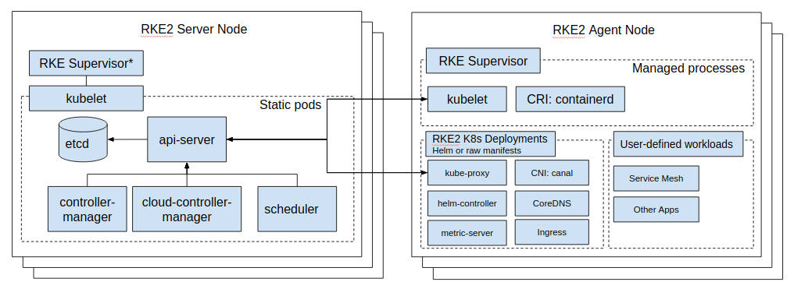

### Architecture Overview

With RKE2 we take lessons learned from developing and maintaining our lightweight [Kubernetes][io-kubernetes]
distribution, [K3s][io-k3s], and apply them to build an enterprise-ready distribution with [K3s][io-k3s] ease-of-use.
What this means is that RKE2 is, at its simplest, a single binary to be installed and configured on all nodes expected
to participate in the [Kubernetes][io-kubernetes] cluster. Once started, RKE2 is then able to bootstrap and supervise
role-appropriate agents per node while sourcing needed content from the network.

RKE2 brings together a number of Open Source technologies to make this all work:

- [K3s][io-k3s]
    - [Helm Controller][gh-helm-controller]
- [K8s][io-kubernetes]
    - [API Server][gh-kube-apiserver]
    - [Controller Manager][gh-kube-controller-manager]
    - [Kubelet][gh-kubelet]
    - [Scheduler][gh-kube-scheduler]
    - [Proxy][gh-kube-proxy]
- [etcd][io-etcd]
- [runc][gh-runc]
- [containerd][io-containerd]/[cri][gh-cri-api]
- [CNI][gh-cni]: Canal ([Calico][org-projectcalico] &amp; [Flannel][gh-flannel]), [Cilium][io-cilium] or [Calico][org-projectcalico]
- [CoreDNS][io-coredns]
- [NGINX Ingress Controller][io-ingress-nginx]
- [Metrics Server][gh-metrics-server]
- [Helm][sh-helm]

All of these, except the NGINX Ingress Controller, are compiled and statically linked with [Go+BoringCrypto][gh-goboring].

### Process Lifecycle

#### Content Bootstrap

RKE2 sources binaries and manifests to run both _server_ and _agent_ nodes from the RKE2 Runtime image.
This means RKE2 scans `/var/lib/rancher/rke2/agent/images/*.tar` for the [`rancher/rke2-runtime`](https://hub.docker.com/r/rancher/rke2-runtime/tags)
image (with a tag correlating to the output of `rke2 --version`) by default and if it cannot be found, attempts to pull
it from the network (a.k.a. Docker Hub). RKE2 then extracts `/bin/` from the image, flattening it into
`/var/lib/rancher/rke2/data/${RKE2_DATA_KEY}/bin` where `${RKE2_DATA_KEY}` represents a unique string identifying the
image.

For RKE2 to work as expected the runtime image must minimally provide:

- **`containerd`** (the [CRI][gh-cri-api])
- **`containerd-shim`** (shims wrap `runc` tasks and do not stop when `containerd` does)
- **`containerd-shim-runc-v1`**
- **`containerd-shim-runc-v2`**
- **`kubelet`** (the Kubernetes node agent)
- **`runc`** (the OCI runtime)

The following ops tooling is also provided by the runtime image:

- **`ctr`** (low level `containerd` maintenance and inspection)
- **`crictl`** (low level CRI maintenance and inspection)
- **`kubectl`** (kubernetes cluster maintenance and inspection)
- **`socat`** (needed by `containerd` for port-forwarding)

After the binaries have been extracted RKE2 will then extract [`/charts/`](../charts/) from the image
into the `/var/lib/rancher/rke2/server/manifests` directory.

#### Initialize Server

In the embedded K3s engine servers are specialized agent processes which means that the following startup will be
deferred until the node container runtime has started.

##### Prepare Components

###### `kube-apiserver`

Pull the `kube-apiserver` image, if not present already, and spin up a goroutine to wait for `etcd`
and then write the static pod definition in `/var/lib/rancher/rke2/agent/pod-manifests/`.

###### `kube-controller-manager`

Pull the `kube-controller-manager` image, if not present already, and spin up a goroutine to wait for `kube-apiserver`
and then write the static pod definition in `/var/lib/rancher/rke2/agent/pod-manifests/`.

###### `kube-scheduler`

Pull the `kube-scheduler` image, if not present already, and spin up a goroutine to wait for `kube-apiserver`
and then write the static pod definition in `/var/lib/rancher/rke2/agent/pod-manifests/`.

##### Start Cluster

Spin up an HTTP server in a goroutine to listen for other cluster servers/agents then initialize/join the cluster.

###### `etcd`

Pull the `etcd` image, if not present already, and spin up a goroutine to wait for the `kubelet`
and then write the static pod definition in `/var/lib/rancher/rke2/agent/pod-manifests/`.

###### `helm-controller`

Spin up the goroutine to start the embedded `helm-controller` after waiting for `kube-apiserver` to be ready.

#### Initialize Agent

The agent process entry point. For server processes the embedded K3s engine invokes this directly.

##### Container Runtime

###### `containerd`

Spawn the `containerd` process and listen for termination. If `containerd` exits then the `rke2` process will also exit.

##### Node Agent

###### `kubelet`

Spawn and supervise the `kubelet` process. If `kubelet` exits then `rke2` will attempt to restart it.
Once the `kubelet` is running it will start any available static pods. For servers this means that `etcd`
and `kube-apiserver` will start, in succession, allowing the remaining components started via static pod
to connect to the `kube-apiserver` and begin their processing.

##### Server Charts

On server nodes, the `helm-controller` can now apply to the cluster any [charts](../charts/) found in `/var/lib/rancher/rke2/server/manifests`.

- rke2-canal.yaml or rke2-cilium.yaml (daemonset, bootstrap)
- rke2-coredns.yaml (deployment, bootstrap)
- rke2-ingress-nginx.yaml (deployment)
- rke2-kube-proxy.yaml (daemonset, bootstrap)
- rke2-metrics-server.yaml (deployment)

#### Daemon Process

The RKE2 process will now run indefinitely until it receives a SIGTERM or SIGKILL or if the `containerd` process exits.

[gh-k3s]: <https://github.com/k3s-io/k3s> "K3s - Lightweight Kubernetes"
[io-k3s]: <https://k3s.io> "K3s - Lightweight Kubernetes"
[gh-kubernetes]: <https://github.com/kubernetes/kubernetes> "Production-Grade Container Orchestration"
[io-kubernetes]: <https://kubernetes.io> "Production-Grade Container Orchestration"
[gh-kube-apiserver]: <https://github.com/kubernetes/kubernetes/tree/master/cmd/kube-apiserver> "Kube API Server"
[gh-kube-controller-manager]: <https://github.com/kubernetes/kubernetes/tree/master/cmd/kube-controller-manager> "Kube Controller Manager"
[gh-kube-proxy]: <https://github.com/kubernetes/kubernetes/tree/master/cmd/kube-proxy> "Kube Proxy"
[gh-kube-scheduler]: <https://github.com/kubernetes/kubernetes/tree/master/cmd/kube-scheduler> "Kube Scheduler"
[gh-kubelet]: <https://github.com/kubernetes/kubernetes/tree/master/cmd/kubelet> "Kubelet"
[gh-cri-api]: <https://github.com/kubernetes/cri-api> "Container Runtime Interface"
[gh-containerd]: <https://github.com/containerd/containerd> "An open and reliable container runtime"
[io-containerd]: <https://containerd.io> "An open and reliable container runtime"
[gh-coredns]: <https://github.com/coredns/coredns> "DNS and Service Discovery"
[io-coredns]: <https://coredns.io> "DNS and Service Discovery"
[gh-ingress-nginx]: <https://github.com/kubernetes/ingress-nginx> "NGINX Ingress Controller for Kubernetes"
[io-ingress-nginx]: <https://kubernetes.github.io/ingress-nginx> "NGINX Ingress Controller for Kubernetes"
[gh-metrics-server]: <https://github.com/kubernetes-sigs/metrics-server> "Cluster-wide aggregator of resource usage data"
[org-projectcalico]: <https://docs.projectcalico.org/about/about-calico> "Project Calico"
[gh-flannel]: <https://github.com/coreos/flannel> "A network fabric for containers, designed for Kubernetes"
[io-cilium]: <https://cilium.io> "eBPF-based Networking, Observability, and Security"
[gh-etcd]: <https://github.com/etcd-io/etcd> "A distributed, reliable key-value store for the most critical data of a distributed system"
[io-etcd]: <https://etcd.io> "A distributed, reliable key-value store for the most critical data of a distributed system"
[gh-helm]: <https://github.com/helm/helm> "The Kubernetes Package Manager"
[sh-helm]: <https://helm.sh> "The Kubernetes Package Manager"
[gh-helm-controller]: <https://github.com/k3s-io/helm-controller> "Helm Chart CRD"
[gh-cni]: <https://github.com/containernetworking/cni> "Container Network Interface"
[gh-runc]: <https://github.com/opencontainers/runc> "CLI tool for spawning and running containers according to the OCI specification"
[gh-goboring]: <https://github.com/golang/go/tree/dev.boringcrypto/misc/boring> "Go+BoringCrypto"
